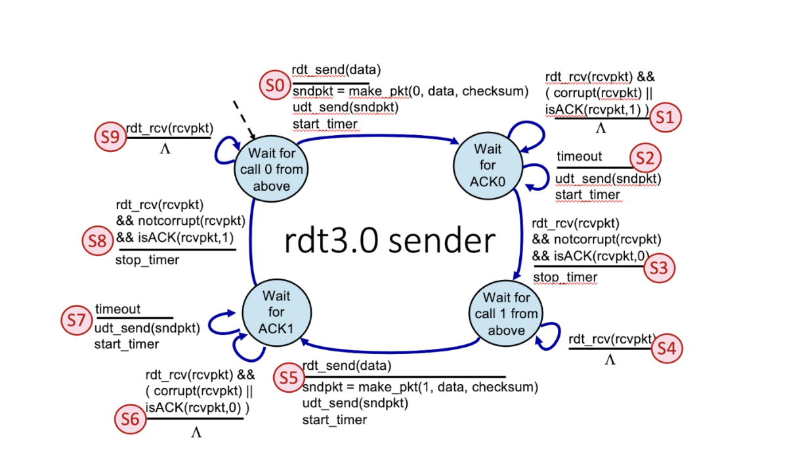
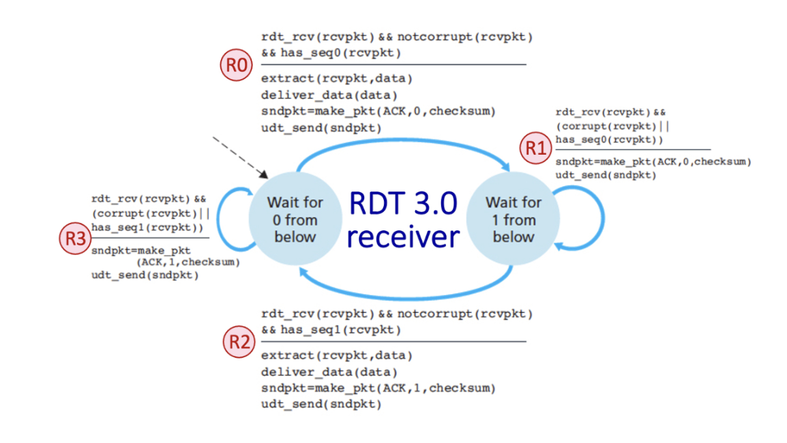

# UDP Reliable File Transfer Using Stop and Wait protocol rdt3.0

## Introduction
This project implements a reliable file transfer protocol using Stop and Wait protocol rdt3.0 over UDP. It ensures data is sent and acknowledged correctly, simulating and accounting for potential errors and packet loss. The communication is unidirectional, with data flowing from the client to the server.

## Compilation
To compile the server and client programs, use the following commands:

```sh
gcc -o udp_server udp_server.c
gcc -o udp_client udp_client.c
```

This will create executable files ```udp_server``` and ```udp_client```.

## Execution
### Running the Server
To run the server, execute the following command, specifying the port number and destination file name:

```sh
./udp_server <port> <destination file>
```

The server will start and wait for incoming UDP packets from the client.

### Running the Client
To run the client and send data to the server, execute the following command, specifying the IP address, port number, and source file name:

```sh
./udp_client <IP address> <port> <source file>
```

The client will read data from the source file and send it to the server using the Stop and Wait protocol.

## File Descriptions
### udp_server.c
This file contains the code for the UDP server. It performs the following tasks:
- Creates a UDP socket.
- Binds the socket to a specific port.
- Listens for incoming UDP packets.
- Receives data, checks for errors, and sends acknowledgments.
- Writes data to the specified destination file.

### udp_client.c
This file contains the code for the UDP client. It performs the following tasks:
- Creates a UDP socket.
- Reads data from the specified source file.
- Sends data to the server's IP address and port using the Stop and Wait protocol.
- Waits for acknowledgments and handles retransmissions in case of errors or timeouts.

### src1.dat and src2.dat
These are data files that can be used by the UDP client. The client reads data from a file and sends it to the server.

### dst1.dat
This is an example of a destination file for data received by the server from the client as a result of sending src1.dat. 

## Protocol
### Header Structure
- `seq_ack`: int (32 bits) - SEQ number (0 or 1) for data and ACK number (0 or 1) for acknowledgment.
- `len`: int (32 bits) - Length of the data in bytes (zero for ACKs).
- `cksum`: int (32 bits) - Checksum calculated for error detection.

### Packet Structure
- `header`: Contains `seq_ack`, `len`, and `cksum`.
- `data`: char (10 bytes) - Data payload.

### Checksum Calculation
A simple checksum algorithm using longitudinal parity check (XOR of all bytes):

```c
int checksum = 0;
char *ptr = (char *)&packet;
char *end = ptr + sizeof(Header) + sizeof(packet);
while (ptr < end)
    checksum ^= *ptr++;
```

### Protocol Logic
#### Client
- Sends a packet with a 1-byte checksum
- Starts a timer and waits for an acknowledgement (ACK)
- Retransmits the packet if no ACK is received within the timeout period or a corrupted ACK is received
- Sends the next packet upon receiving the correct ACK



#### Server
- Receives a packet and checks its checksum
- Sends the corresponding ACK if the packet is correct
- Handles duplicate data messages and duplicate ACK messages properly



## Simulation of Error and Loss
- Use a random function to decide whether to send the correct checksum or an incorrect one
- Use a random function to simulate dropping packets or ACKs

## Note
The server closes the file and terminates after receiving a packet with zero bytes. To prevent the client from resending forever in case the final ACK is lost, the client will resend the last packet with zero bytes a maximum of three times before stopping.
